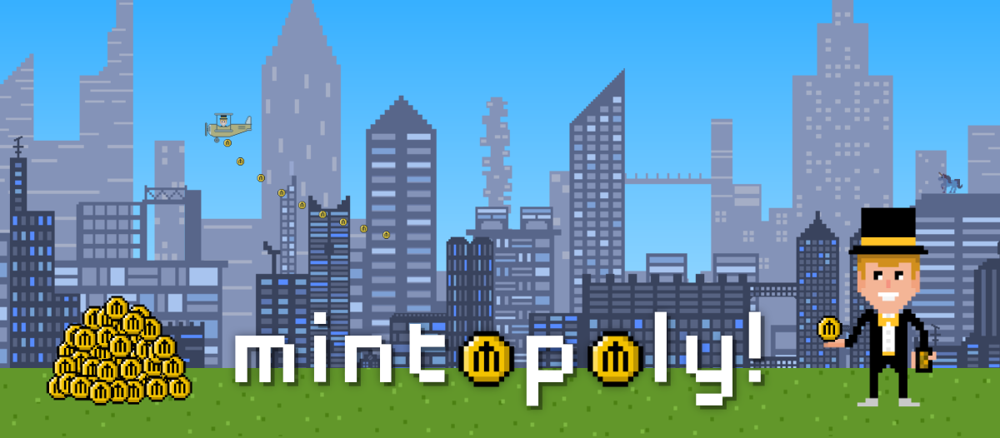

# Welcome to Mintopoly

Mintopoly is a crypto-based universe (a Mintoverse!) with several games, a thriving community, NFT Mintopoly Cards, and its own token ($MM) distributed throughout the community.&#x20;

Currently, the two primary hubs in the Mintoverse are:

****[**Blockchain Simulator Game**](simulator-game/gameplay-guide/) – Now running for over 1 year, the Blockchain Simulator game is a weekly, gobal competition to earn as much crypto as possible on our simulated blockchain. Top players with the highest "net worth" earn token airdrops, NFT cards, and more.&#x20;

****[**The Mintopoly Moon**](mintopoly-moon/moon-overview.md) – To create a central hub for the Mintoverse, mintopoly is going to the moon. Literally! Mintopoly Moon is a lunar colonly with 7,000 NFT bases that players can purchase with $MM tokens which generate 9 types of in-game resources that can ultimatley be used for base upgrades, games, and much more.&#x20;

If you're new, we strongly recomment you [**Join our Discord**](https://discord.com/invite/zJQd3CGp5j) and follow us on [**Twitter**](https://twitter.com/mrmintopoly) for the latest updates.&#x20;

