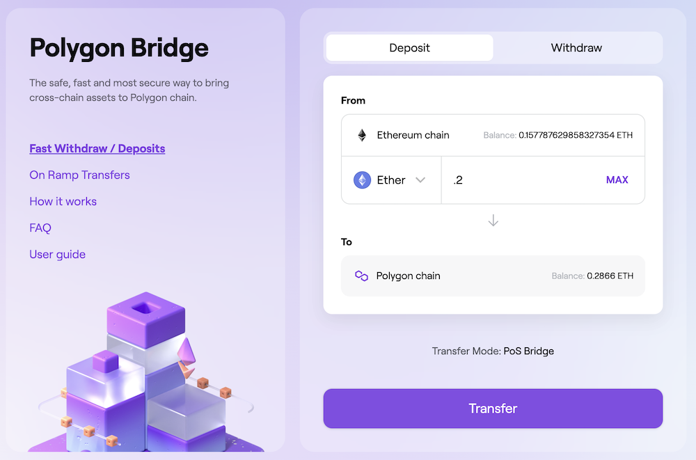
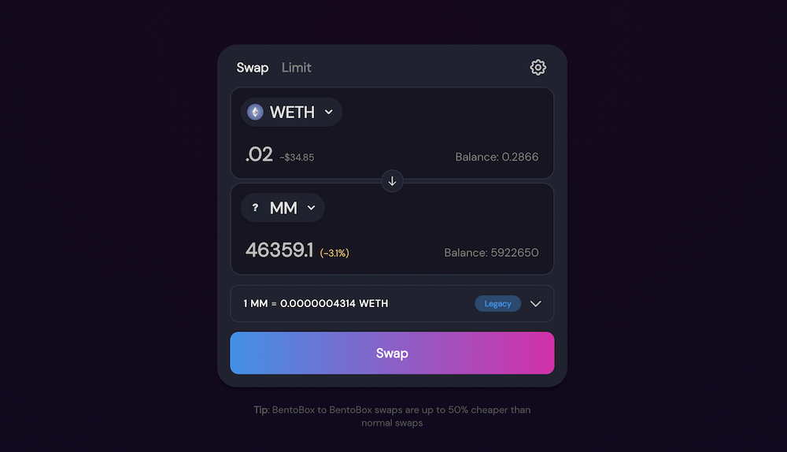

# $MM Token

Mintopoly Money (MM) is the Polygon-based (ERC-20) cryptocurrency that forms the backbone of the Mintopoly ecosystem. It features a capped supply of 100 million tokens and is located on ETH _and_ Polygon (more on that below) at the following contract address: 0xf6a09deadf5a10aa7822d95e3228b2315de8f6fa

**Tokens can be earned by being a top finisher (usually top 100-250) in the weekly simulator game.** Over the first 50 weeks (July 2021 to July 2022), Mintopoly distributed 1 million tokens per week directly to the community of players who earned them. Beyond that timeframe, weekly airdrops continue at a smaller rate via recycled tokens from in-game purchases and a tax on moon exchanges.

### $MM Token Uses

**Moon NFT Bases** – On the Mintopoly Moon, players can claim and own NFT-based plots of moon land exclusively with in-game "resoruces" – these resoruces are backed by the $MM token on an open exchange, allowing players to essentially purchase bases directly with $MM tokens – and earn tokens by selling the resources their bases generate. See [Moon Resources ](../../mintopoly-moon/resources.md)for more.  \

**Simulator Game Boosts** - With the new "dark web" store within the simulator game, players can now use their tokens directly in the game to purchase boost & power-ups for yourself and sabotages against other players. This makes Mintopily one of the first blockchain-based games to actually use its native token within the game. And it's just getting started.\

**NFT Card Purchases** - Our smart contract provides for 4,000 special-edition NFT Mintopoly cards to be purchased exclusively with $MM. These are pending development, ideally new card types that provide new functionality for both the Simulator and Moon.&#x20;

### How to Purchase MM Tokens

Mintopoly Money tokens can be purchased on the SushiSwap Decentralized Exchange with wrapped ETH tokens on Polygon at the following link - [**WETH/MM on SushiSwap**](https://app.sushi.com/swap?tokens=0x7ceB23fD6bC0adD59E62ac25578270cFf1b9f619\&tokens=0xF6a09deadF5A10aA7822d95e3228b2315De8f6fa\&chainId=137). \[If that link does not automatically load the pair, simply choose WETH from the token to send and enter the MM contract address as the token to recieve - `0xF6a09deadF5A10aA7822d95e3228b2315De8f6fa` and double check that you are on the Polygon network (not ETH in the top right).&#x20;

Further details on each step of this process are detailed below:

#### 1. Convert ETH to WETH&#x20;

Assuming you have standard ETH in your MetaMask wallet that you would like to use to purchase MM tokens, that ETH needs to be moved to "Wrapped ETH" on the Polygon Chain. The easiest way to do this is via the official polygon app - [https://wallet.polygon.technology/bridge](https://wallet.polygon.technology/bridge). Enter the amount you'd like to "bridge" and click confirm. There will be a small ETH gas fee and this will take about 10 minutes to complete.


**TIP FOR COINBASE USERS**

Coinbase recently introduced cross-chain ETH which is exactly what we need. If you have ETH on Coinbase, you can send it to your own MetaMask wallet address, choose Polygon as the network, and skip the above step.


#### 2. GAS Tokens

Performing transactions on Polygon (such as the below token exchange or making purchases on the Mintopoly Moon) requires MATIC tokens just as Ethereum requires ETH tokens. Thankfully, gas is extremely cheap and 1 MATIC ($0.90 at the time of writing) is enough for hundreds of transactions. **To acquire a small amount of MATIC** Polygon's official app makes it easy. Visit [https://wallet.polygon.technology/gas-swap](https://wallet.polygon.technology/gas-swap) and choose your newly bridged ETH tokens to exchange a small amount for 1-2 MATIC tokens.

#### 3. Exchange

Visit the SushiSwap app to exchange tokens –  [**WETH/MM on SushiSwap**](https://app.sushi.com/swap?tokens=0x7ceB23fD6bC0adD59E62ac25578270cFf1b9f619\&tokens=0xF6a09deadF5A10aA7822d95e3228b2315De8f6fa\&chainId=137)**.** If that link doesn't automatically load the pair, simply choose WETH from the token to send and enter the MM contract address as the token to recieve - `0xF6a09deadF5A10aA7822d95e3228b2315De8f6fa` and double check that you are on the Polygon network (not ETH in the top right) to perform the exchange. Enjoy your new MM tokens!

### Token Distribution

Mintopoly! Money has a capped supply of 100 million tokens. For the first 50 rounds (ending July 2022), 1 million tokens are being distributed to the top (X00) finishers of each round.\
\
**Approximate Initial Token Distribution (100 million total supply)**\
50% – Distribution to players throughout the first 50 rounds\
15% – Team and Advisors\
15% – Development and Marketing\
10% – Reserves and Private Sales\
10% – Liquidity pool and liquidity incentives (see below)\
\
Beyond the first 50 rounds, distributions are likely to continue at a lower rate per round. As tokens are used for game purchases (such as moon purchases or in-game transactions), these tokens are returned to the contract originator and can be re-distributed.\
\
**Liquidity Pool Incentives**\
While any token owner can create a liquidity pool a decentralized exchange at any time, we expect to take the lead on this front, establishing a liquidity pool on UniSwap in 2022, as utility functions for the token begin to roll out. To support a deep and liquid exchange, we are likely to simultaneously introduce an incentive program that will provide daily rewards of MM split across all liquidity providers. Details on this program will be provided closer to launch.

### $MM on Polygon

**\[Note: Currently, all primary uses of the token are performed with the Polygon-based tokens. Unless you have been playing since before round 5, you will likely only ever need to interact with the Polygon tokens.]**

Mintopoly! Money is an Ethereum-based token. That makes it highly secure and flexible, but it also means that gas fees are prohibitively high for most transactions. To address this, we created a layer 2 token on the Polygon network to enable secure, decentralized, lightning-fast transactions that cost a fraction of a cent – all while retaining access to the root Ethereum tokens.\
\
This is a HUGE step for the game, because it allows us to quickly send airdrops directly from the vault to hundreds of players instantly. It also paves the way for an exciting future of in-game transactions.\
\
When the MM tokens are moved from Ethereum into the Polygon bridge, the original Ethereum-based tokens are safely locked up and the same amount of new Polygon-based tokens are minted.\
\
When the owner wants to withdraw their tokens back to the Ethereum mainnet, the Polygon tokens are burned and the same amount of Ethereum tokens are unlocked and returned to the owner. Owners can move their funds between Ethereum and Polygon at will.

Transactions to / from the bridge can be preformed on the [official Polygon bridge](https://wallet.polygon.technology/bridge). Simply connect your wallet and select Mintopoly Money from the dropdown – **NOTE: be aware that ETH gas fees will be required to move funds across the bridge in either direction**.
