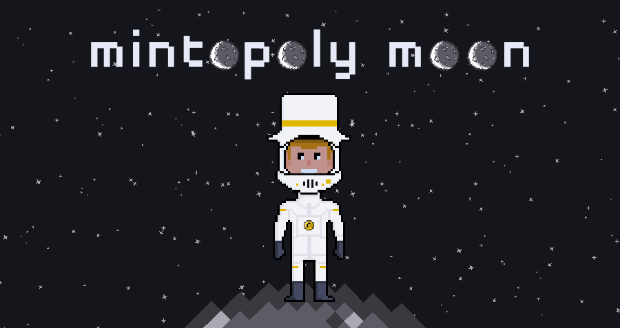

# Moon Overview

Mintopoly Moon is a lunar settlement with 7,000 NFT moon bases owned by players. It is a free-to-play crypto game built around land ownership, resource trading, and community – much like a real-world economy. Each base generates a specific type of resource that can be harvested regularly to be used within the game or sold on the open exchange – all backed by the existing [Mintopoly Money](https://mintopoly.io/token) token.

### Vision: The Center of the Mintoverse&#x20;

The overarching vision for the Mintopoly Moon is to create a thriving ecosystem built around land ownership, resource generation, games, and community – all backed by blockchain technology (and the existing $MM Tokens) to provide true ownership. **The Moon bases are designed to provide owners with a central store of value in the Mintoverse, with a solid foundation for near-infinite development possibilities.** Particularly, we see these developments on the horizon to engage and reward land owners... ****&#x20;

* **Full Moon Airdrops** – Providing a unique airdrop every lunar cycle to all base owners who complete the challenges.
* **Upgrades** – Moon bases are intended to be dynamic and upgradable. As the economy develops, we plan on introducing numerous upgrades that can be purchased directly with in-game resources to make the land more productive, efficient, and scarce – permanently increasing the value of the base and the NFT behind it.
* **Monetization** - With bases requiring manual harvesting multiple times per day, this creates advertising opportunities on every base, allowing owners to install "billboards" on which they can display their own ads or rent out space on the lunar ad network to earn real revenue.
* **Moon Games** – Numerous types of games and challenges that require players to invest in or wager in-game resources, form teams (and rivalries), and compete to win resources, $MM tokens, special NFTs, or even rare items/upgrades to display on the base itself.
* **Participation in Events** - Giving owners exclusive access to moon-wide events with brands or partner projects - and even private events organized directly by base owners.

In addition, virtually all developments will be designed to add demand and value to in-game resources, providing base owners with a robust opportunity to utilize or sell their harvested resources.

### Quickstart

Accessing the moon is easy and free, but here’s what you’ll need to get started and make the most out of your experience.

#### 1. Browser Wallet (Metamask)

Logging into the Moon is done with an Ethereum address instead of a username and password. You will need a browser-based Ethereum wallet like the Metamask extension for Chrome (recommended), or the Metamask mobile apps. Additional wallets such as Brave or Trust Wallet may work but are not fully supported.

#### 2. Matic & $MM Tokens

Owning Mintopoly Money tokens is not required to use the moon, however, they can be used to purchase resources on the open exchange so that you can more quickly stake claims to plots of land and ultimately mint them as NFTs.

In addition, all transactions on the moon (exchange purchases, minting bases) are done on the Polygon blockchain, which uses the MATIC token for gas fees. You’ll need a very small amount of this (.01 is usually enough for many transactions) to exchange tokens or mint bases.

#### 3. Moon Visa

One of the first actions a player should take is to purchase a moon visa. A visa is required in order to 1) stake claims on plots of land and 2) sell resources on the exchange. However, you can still access the moon and harvest bases without one. This permanent visa is a one-time purchase from your account page and it can be made with any category of in-game resources.

\
\
\
